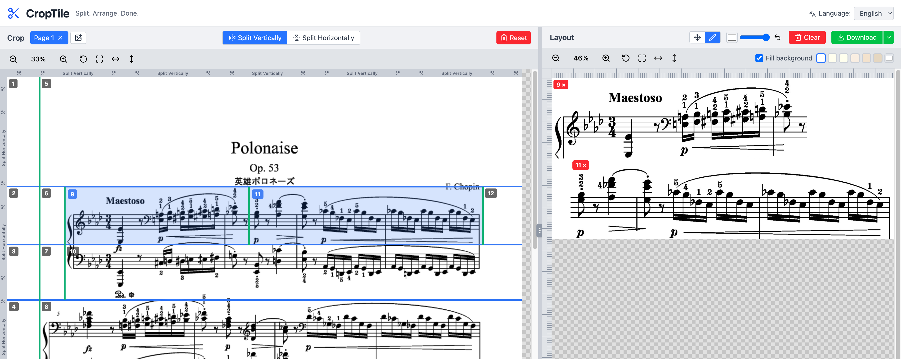

# CropTile

https://pokutuna.github.io/croptile/

Split. Arrange. Done.



A browser-based tool for splitting images into sections and rearranging them into new layouts. Perfect for extracting portions of sheet music images to create layouts for YouTube performance videos.

- No upload required - all processing happens in your browser
- Your images never leave your device

## Features

- Load images and draw split lines to create cells
- Click cells to add them to the layout area
- Drag to arrange freely with snap-to-edge alignment
- Add annotations with the pen tool
- Set background color and export as PNG

## Usage

1. Load an image in the left panel
2. Draw vertical/horizontal lines to create cells
3. Click cells to add them to the right panel
4. Drag to adjust placement
5. Download as PNG

## Development

```bash
npm install
npm run dev
```

## Tech Stack

- React 19 + TypeScript
- Vite
- Zustand
- Tailwind CSS v4

## License

Apache-2.0
